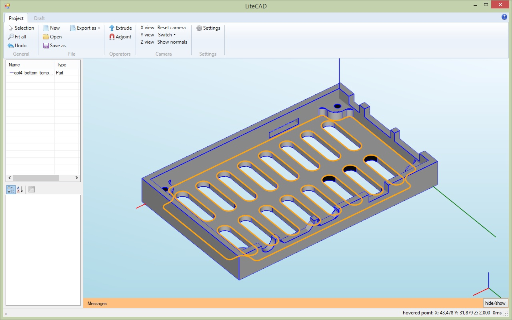
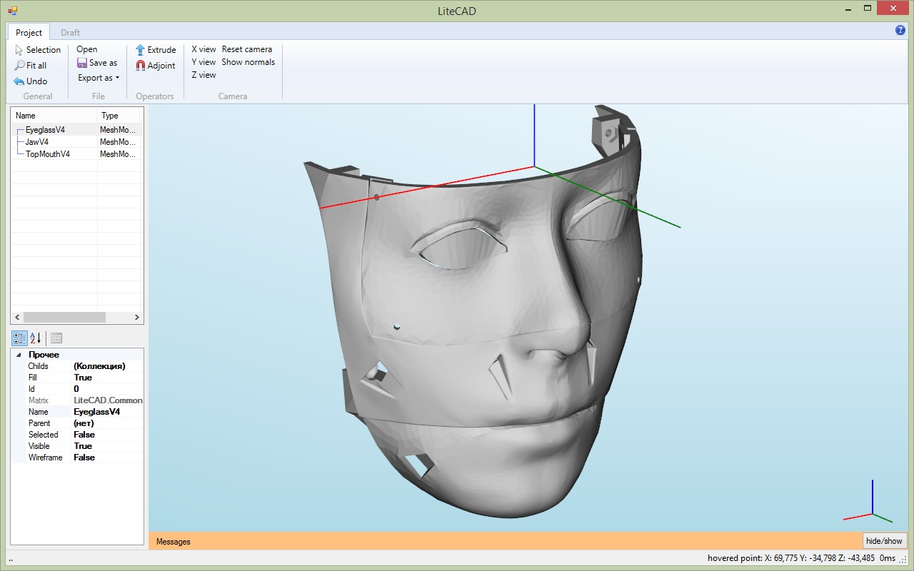
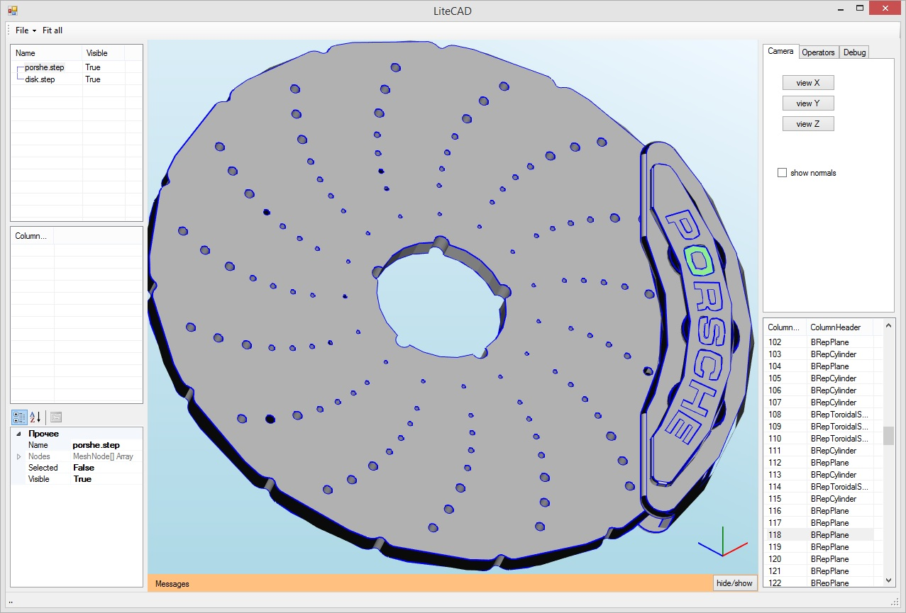
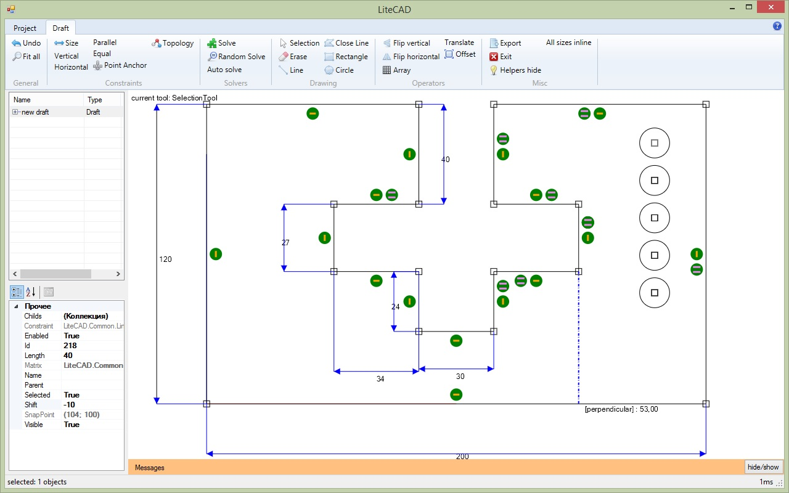

# :triangular_ruler: LiteCAD

Simple CAD for designing 2D/3D parts and assemblies  :straight_ruler:

**Supported formats:** <a href="https://en.wikipedia.org/wiki/Boundary_representation">BREP</a> (Step, IGES), STL, Dxf

:pencil2: **2D drawer:** Skia (https://github.com/mono/SkiaSharp) or GDI 
:pencil2: **3D drawer:** OpenGL (<a href="https://github.com/opentk/opentk">OpenTK</a>)

:warning:**Project status:** WIP  :construction::construction_worker: (not all functions are fully supported:warning:)

  

Draft editor:

## References:
* Original Triangle code by Jonathan Richard Shewchuk, http://www.cs.cmu.edu/~quake/triangle.html
* Triangle.NET code by Christian Woltering, http://triangle.codeplex.com/
* polybooljs (https://github.com/velipso/polybooljs)
* polyBoolCS (https://github.com/StagPoint/PolyBoolCS)
* clipper (http://www.angusj.com/delphi/clipper.php)
* NURBS (https://www.codeproject.com/Articles/1095142/Generate-and-understand-NURBS-curves)
* https://github.com/ixmilia/dxf
* https://github.com/ixmilia/iges

Some icons by [Yusuke Kamiyamane](http://p.yusukekamiyamane.com/). Licensed under a [Creative Commons Attribution 3.0 License](http://creativecommons.org/licenses/by/3.0/)
